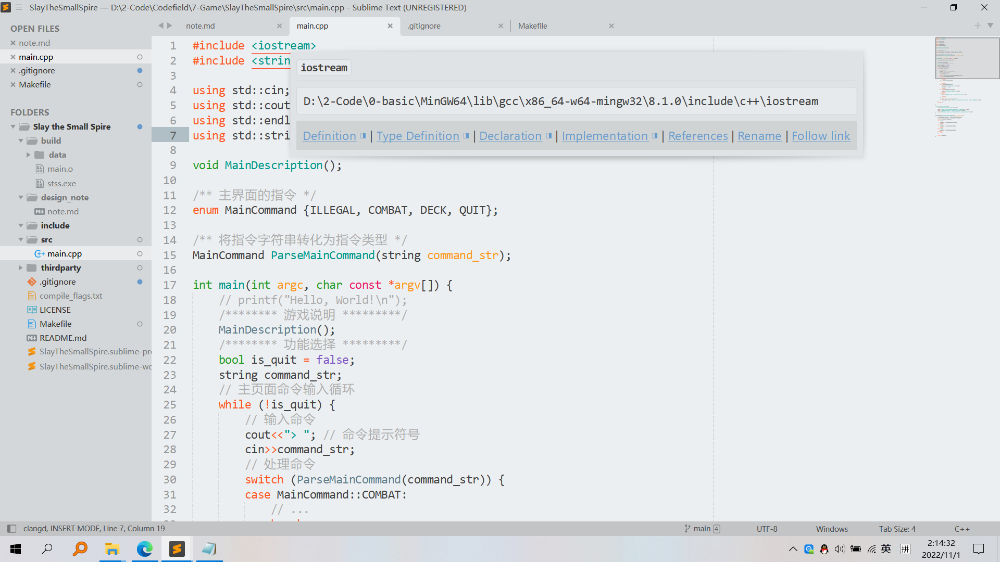

# LLVM

## 杂项
### clang 在 Windows 下使用 MinGW 进行编译
`--target=x86_64-pc-windows-gnu`

### Sublime 使用 LSP 连接 clangd 时找不到标准库文件的问题
你他妈知道凌晨两点我在工程文件夹根目录添加了一个仅包含一行参数的文件后它成功了我有多高兴吗

总结一下使用
1. 对项目使用（单文件就先别想着用 clangd 还能避免标准库头文件报错了）
2. 根目录下添加`compile_flags.txt`文件，里面是 clang 编译时的参数，Windows 使用 64 位 MinGW 需要加`--target=x86_64-pc-windows-gnu`

未解决的问题：自己的头文件还是找不到（即使用了`-I`）
* 解决了，`compile_flags.txt`文件中，参数要分行写
* 注意，`-I`和后面的路径必须紧跟着，不能空格
