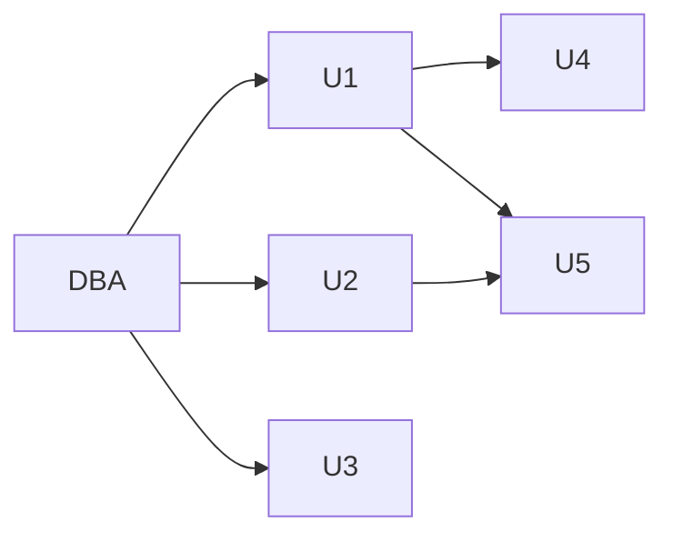

# ZJU数据库系统


## Chapter 2: Relational Model
### 2.1 What is relational model
relation: table with rows and columns (mathematical concept)
relationship: association of entities (in chapter 6)

### 2.2 Basic Structure
A relation r is a subset of the cartesian product (笛卡儿积) of a list of domain Di.
Or: is a set of n-tuples where each aij belongs to Di.
$$
r \subseteq D_1 \times D_2 \times ... \times D_n (D_i = a_{ij} |_{j=1..k}) \\
or\quad\{(a_{1j}, a_{2j}, ..., a_{nj}) | j=1..k\}, each\ a_{ij} \in D_i
$$

#### (1) Attribute Types (属性)
domain: set of allowed values for each attribute  
null value

#### (2) Concepts about Relation
Relation
1. relation schema: 表头样式
2. relation instance：实际数据

#### (3) Relations are Unordered (无序)
#### (4) Keys (键，码)
superkey(超码): 能唯一确定
candidate key(候选码): 最小超码
primary key(主码): 被指定的候选码

#### (5) Foreign Key (外键，外码)
### 2.3 Relational Algebra
Six Basic Operators:
1. Select 选择
2. Project 投影
3. Union 并
4. Set Difference （集合）差
5. Cartesian Product （广义）笛卡儿积
6. Rename 重命名

Additional Operations
7. Set Intersection 交
8. Natural Join 自然连接
9. Division 除
10. Assignment 赋值

#### (1) Select (选择)
$$
\sigma_p(r) = \{t|t\in r\ and\ p(t)\} \\
e.g.\quad\sigma_{dept\_name='Finance'}(department)
$$
p是选择的条件，可以是比较判断（=，>，<等），可以包含逻辑运算（and，or，not等）。

#### (2) Project (投影)
$$
\Pi_{A_1,A_2,...,A_k}(r)
$$
选择一部分属性显示。

#### (3) Union (并)
$$
r\cup s = \{t|t\in r\ or\ t\in s\}
$$
限制：r，s必须等目（同元），即属性数量相同。

#### (4) Set Difference (差)
$$
r-s = \{t|t\in r\ and\ t\notin s\}
$$

#### (5) Cartesian Product (广义笛卡儿积)
$$
r\times s = \{\{tq\}|t\in r\ and\ q\in s\} \\
$$
attributes of r(R) and s(S): $R\cap S=\varnothing$ (if not: rename).

#### (6) Rename (重命名)
$$
\rho_X(E) \\
\rho_{X(A1, A2, ..., An)}(E)
$$

#### (7) Set Intersection (交)
$$
r\cap s = \{t|t\in r\ and\ t\in s\}
$$

#### (8) Natural Join (自然连接)
$$
r\bowtie s
$$

#### (9) Division Operation (除)
$$
r\div s
$$
首先，r除以s的结果只包含：r中的元组，且属性为r-s的属性；  
其次，对于r中的一系列元组（以r-s的属性分类），只有当其包含s中的所有属性时，这一系列元组才会被保留。

举例：


#### (10) Assignment (赋值)
$$
temp\leftarrow r
$$

### 2.4 Extended Relational Algebra Operations
#### (1) Generalized Projection (广义投影)
$$
\Pi_{F1,F2,...,Fn}(E)
$$
Fi是算数表达式。也就是说，投影不一定是原属性，也可以是原属性计算后的结果。

#### (2) Aggregate Functions (聚集函数)
$$
{}_{G1,G2,...,Gn}\mathcal{G}_{F_1(A_1),F_2(A_2),...,F_n(A_n)}(E)
$$
Gi: 用于分组的属性
Fi: 聚集函数
Ai: 属性名

`avg, min, max, sum, count`

#### (3) Outer Join (外连接)
#### (4) Null Values (空值)
## Chapter 3: Introduction to SQL
DDL (Data-definition Language) 数据定义  
DML (Data-manipulation Language) 数据操纵  
DCL (Data-control Language) 数据控制

### 3.1 Data Definition Language
典型：create table，包括schema中attributes的名称、类型，以及foreign key等约束。

#### (1) Domain Types in SQL
char(n), varchar(n)  
int, smallint, numeric(p,d), real, double precision, float(n)  
date, time, Timestamp

#### (2) Create Table Construct
```sql
create table instructor (
	ID char(5),
	name varchar(20) not null,
	dept_name varchar(20),
	salary numeric(8,2),
	primary key (ID),
	check (salary >= 0)
);
```

#### Drop and Alter Table
```sql
drop table r;

alter table r add A D; # A: attribute; D: domain
alter table r add (A1 D1, ..., An Dn); # A: attribute; D: domain

alter table r drop A;

alter table r modify (A1 D1, ..., An Dn);
```

#### Create Index
```sql
create index <i-name>
on <table-name>(<attribute-list>)
create unique index <i-name> # unique: specify a candidate key
on <table-name>(<attribute-list>)

drop index <i-name>
```

### 3.2 Basic Structure of select


#### (1) The select Clause
**distinct**: eliminate the duplicates
```sql
select distinct dept_name
from instructor
```
**\***: all attributes
```sql
select * from instructor
```

#### (2) The where Clause
logical connectives: `and, or, not, between and`
* between and: l <= x <= r

#### (3) The from Clause
#### (4) The Rename Operation
**as**: `name as newname`

#### (5) String Operations
模糊匹配：“%”匹配任意子串，“\_”匹配任意字符，“||”串联字符串

大小写转换函数：lower()，upper()

#### (6) Ordering the Display of Tuples
```sql
select *
from instructor
order by salary desc, name asc;
```

#### (7) Duplicates
### 3.3 Set Operations (集合操作)
union, intersect (交集), except, 自动去重
保留重复: union all, intersect all, except all

### 3.4 Aggregate Functions
multiset of values of a column -> a value

select中，不在聚集函数中的属性必须包含在group by中  
使用聚集函数的值判断：having子句（其中不在聚集函数中的属性也必须包含在group by中）
```sql
select dept_name, avg(salary) as avg_salary
from instructor
group by dept_name
having avg(salary) > 42000
```

**执行顺序: From -> where -> group -> having -> select -> order by**

对于有空值的情况：All aggregate operation **except** `count(*)` ignore tuples with null values.

### 3.5 Null Values
null: unknown value, does not exist

Three-valued logic (true, unknown, false)
* where子句的值如果是unknown，当作false处理

检验null值: is null, is not null

### 3.6 Nested Subqueries
根据一个查询结果中再进行查询: in，not in
```sql
select count (distinct ID)
from takes
where (course_id, sec_id, semester, year)
	in (select course_id, sec_id, semester, year
		from teaches
		where teaches.ID = 10101);
```

查询结果直接当成数值来用
```sql
# 查询某个属性最大的元组
elect account_number as AN, balance
from accout as A 
where balance >= (select max(balance) # 子查询结果直接当数值用
				  from accout as B
				  where A.branch_name = B.branch_name)
				  # 子查询可以用到父级查询中的名称，这里用了A
order by balance;
```

集合比较
* `<, <=, >, >=, =, <>` + `some`
* `<, <=, >, >=, =, <>` + `all`

空关系测试
* exist, not exist

重复元组测试
* unique (whether a subquery has any duplicate tuples in its result)

### 3.7 Views (视图)
```sql
create view <v_name> as
	select c1, c2, ... from ... ;
create view <v_name> (c1, c2, ...) as
	select e1, e2, ... from ... ;
```

### 3.8 Complex Queries
#### (1) Derived Relations (导出关系)
在from中直接使用（类似子查询）

#### (2) with Clause
定义local view
```sql
with rname(A1, A2, ...) as
	select ... # 局部视图
select ... # 正式查询，可以from rname
```

### 3.9 Modification of the Database
#### (1) Deletion
```sql
delete from <table|view>
[where <condition>];
```

#### (2) Insertion
```sql
insert into <table|view>[(c1, c2, ...)] values (e1, e2, ...);

# 注：先完全做完select，然后再插入
nsert into <table|view>[(c1, c2, ...)]
	select e1, e2, ...
	from ...;
```

#### (3) Updates
```sql
update <table|view> set <c1=e1[, c2=e2, ...]>
[where <condition>];
```

#### (4) Updates for Views
View是虚表，对其的操作会被转化为对基表的操作。  
修改操作有严格限制

#### (5) Transactions (事务)
### 3.10 Joined Relations
\#TODO

## Chapter 4: Intermediate SQL
\#TODO 触发器和断言的区别是什么
* 可能：触发器针对某个操作，断言针对数据是否满足要求

### 4.3 Authorization (授权)
#### (1) Authorization
Forms  
Database: Read, Insert, Update, Delete  
Database schema: Index, Resources, Alteration, Drop

#### (2) Authorization and Views
#### (3) Granting of Privileges

其中DBA是Administrator（管理员），Ui是User（用户）

如果DBA->U1的grant被revoke（撤销），U1->U4的也要被撤销，而U1->U5的不能（因为U5还有一条DBA->U2->U5的authorization path）

#### (4) Security Specification in SQL
`grant <privilege list> on <relation name or view name> to <user list> [with grant option];`
1. privileges in SQL
	- select: read access to relation, or query ability using the view  
	- insert:  
	- update:  
	- delete:  
	- references: declare foreign keys when creating relations  
	- all privileges: all allowable privileges  
	- all
2. user list
	- user-id
	- public (all valid users)
	- a role
3. with grant option: allow the users to pass the privilege to other users

**Roles**: grant privileges to roles, grant roles to users. Example:
```sql
create role instructor;
grant select on takes to instructor;
grant instructor to Amit;

create role dean;
grant instructor to dean;
grant dean to Satoshi;
```

#### (5) Revoking Authorization in SQL
`revoke <privilege list> on <relation name or view name> from <user list> [restrict|cascade]`
* cascade: also revoke other users' privileges
* restrict: preventing cascade

#### (6) Limitations of SQL Authorization
Not support tuple level

### 4.4 Audit Trails (审计跟踪)
本质：**log** of all changes

MySQL好像没有审计

\#TODO

### 4.5 Embedded SQL (嵌入式SQL)
Embedded的含义：SQL语句在写程序的时候已经确定了，静态

多行查询：不是一下全部存起来，而是用游标（Cursor）一条条返回

麻烦：需要预编译

### 4.6 Dynamic SQL
把SQL语句作为字符串传给数据库

ODBC: Open DataBase Connectivity
* API
* 优点：和DBMS无关，不需要预编译

其他类似工具：OLE DB，ADO，DAO，JDBC（java）

使用（初始化->执行语句->获取结果->释放空间）
1. 分配环境句柄
2. 分配连接句柄
3. 用已分配的连接句柄连接数据源
4. 分配语句句柄
5. 直接执行SQL语句 / 有准备地执行SQL语句（对于要多次执行的SQL语句）
6. 查询结果的获取
7. 释放语句句柄
8. 断开数据源连接
9. 释放连接句柄
10. 释放环境句柄

注意要判断函数执行是否成功

## Chapter 6: Entity-Relationship Model
数据库模式要避免的的主要缺陷
1. 冗余：信息重复，且容易冲突不一致
2. 不完整

### 6.1 Entity Sets (实体集)
实体及其属性  
实体集：同类实体的集合
* 形式类似relation
* 表示：*矩形*，“表头”是实体集名称，下面是各属性名称

属性类型
* 简单属性，复合属性
	- 复合属性在E-R图中用*缩进*表示
* 单值属性，多值属性
	- 多值属性用*花括号*括起来，`{phone number}`
* 派生属性
	- 派生属性后面加*括号*，`age()`

### 6.2 Relationship Sets (联系集)
实体之间有联系  
联系集：同类联系的集合
* 形式也类似relation
* 表示：*菱形*，通过线条连到两个（多个）不同的实体集
	- 多个：例如三元联系集（ternany relationship set）

角色：实体在联系中扮演的功能（参考：重命名）。当相同实体集多次参与同一个联系集时，就必须指明角色
* 表示：在线条上标注

描述性属性：联系集中除了实体之外的其他属性
* 用未分割（没有表头）的矩形表示，通过*虚线*与联系集（菱形）相连

Mapping Cardinalities (映射基数)
* 类型
	- 一对一
	- 一对多
	- 多对一
	- 多对多
* E-R图
	- 用*有向箭头*指向“一”的实体集，*无向线条*连接“多”的实体集
	- 如果实体集中的每个实体都必须参与联系，用*双线*
	- 基数限制：在连线上写`a..b`，表示基数约束为a到b（例如`1..2`），\*表示无限制（例如`0..*`）。注意！这里的限制是反的

### 6.3 Keys
用下划线标出作为主码的属性

### 6.4 E-R Diagrams
### 6.5 Weak Entity Sets
弱实体集
	
* **没有主码**
* 依赖于标识实体集（identifying entity set）
	- 类似：第一、第二、……、第十六课时，但是每个课时都必须下属于某一门课
* 联系必须是完全、一对多的联系（双向，箭头指向标识实体集或属主实体集）
* E-R图中，实体集的矩形用*双线框*起来，联系集的菱形也用*双线框*起来

分辨符（discriminator）：在依赖于某个强实体集的前提下，唯一标识弱实体的属性
* 可以有多个
* 用*虚下划线*标出
* 弱实体集的主码为：强实体集的主码 + 弱实体集的分辨符

### 6.6 Extended E-R features
实体集分层
* Specialization / Generalization（特化和泛化）
* **Disjoint / Overlapping**（不相交和可重叠）
* E-R图画法：

### 6.7 Design of an E-R database schema
#### (1) the steps of database design
#### (2) some E-R design considerations
定义成属性还是实体集？（例如人的电话）
* 若只对名字和单值感兴趣，属性
* 若还要其他需要描述的属性，实体集

定义成实体集还是联系集？

定义成属性还是联系？
* 属性：可能会出现冗余和不一致（缺乏语义独立性）

#### 6.8 Reduction of an E-R Schema to Tables Tables
多值属性
* 把属性做成单独的表。例如，导师的电话存成:
	```text
	instructor(ID, name, salary)
	instructor_phone(ID, phone_number)
	```

弱实体集
* 需要把属主实体集的主键加进来

联系集
* 需要把（两边的）主键都加进来
* 选择主键时，如果是一对多，只需要把多端的主键作为主键

表的冗余与合并
* 一对多（多对一）：可以将联系集合并到多端。例如：
	有 department(<u>dept_name</u>, building, budget)  
	对于 instructor(<u>ID</u>, name, salary) 和 inst_dept(<u>ID</u>, dept_name)  
	合并变成 instructor(<u>ID</u>, name, **dept_name**, salary)
* 对于partial的参与（也就是多端），允许null值，否则就有not null的约束
* 弱实体集与相应标识性实体集：联系集对应的表一定是多余的（因为弱实体集的表已经包含了标识性实体集的主键）

特化与泛化
1. 方法一：各自“专属”的属性分别放在不同的表里，用同一个主键（如ID）
2. 方法二：每个表都包含所有的属性

### E-R Notations


## Chapter 7: Relational Database Design
### 7.1 First Normal Form (第一范式)
domains of all attributes of R are **atomic**  
每个属性都是原子不可分的

主要考虑：系统效率

在语义层面：如将多个名字/电话连成一个字符串，或学号用专业+号码（如CS0012，EE1127）的方式设计，虽然实现上是原子的，但语义上不是

### 7.2 Pitfalls in Relational Database Design
坏的设计（如冗余）会导致：插入删除修改异常

手段：**Decomposition**（分解）
* 需要是：Lossless-join decomposition（无损分解），分解后，自然连接等于原来的表

目的：
1. 判断一个关系好不好（No redundant）
2. 将不好的关系分解为好的关系

理论：
1. functional dependencies（函数依赖，函数决定）
2. multivalued dependencies（多值依赖）

### 7.3 Functional Dependencies
简称：**FD**

**函数依赖在一个关系中排除了某些元组**

#### (1) Definition
对于关系R的属性$\alpha\subseteq R\ and\ \beta\subseteq R$，当两个元组t1、t2的$\alpha$相同时，如果一定有他们的$\beta$相同，则称：
* $\beta$函数依赖于（Functionally Dependent on）$\alpha$
* $\alpha$函数决定（Functionally Determines）$\beta$

即$\alpha\rightarrow\beta$

函数依赖可以看作key这一概念的推广

作用一：测试在给定的函数依赖$F$下，relation是否合法  
作用二：在表上设置约束
* F **holds on** R: all legal relations r on R satisfy F

> 注：大写$F$常用于表示函数集，如：
> $F = \{A\rightarrow C, AB\rightarrow D, ABC\rightarrow D\}$

trivial（平凡的）：对于任意关系都恒成立，例如$A\rightarrow A, AB\rightarrow A$

#### (2) Closure of a Set of Functional Dependencies (函数依赖集的闭包)
由$F$能推出的所有函数依赖的集合，记作$F^+$
* 也包括trival的FD

Armstrong's Axioms（公理）
1. reflexivity（自反律）-trival：$if\ \beta\subseteq\alpha,\ then\ \alpha\rightarrow\beta$
2. augmentation（增补律）：$if\ \alpha\rightarrow\beta,\ then\ \gamma\alpha\rightarrow\gamma\beta$
3. transitivity（传递律）：$if\ \alpha\rightarrow\beta\ and\ \beta\rightarrow\gamma,\ then\ \alpha\rightarrow\gamma$

Armstrong公理的补充定律
1. union（合并律）：$if\ \alpha\rightarrow\beta\ and\ \alpha\rightarrow\gamma,\ then\ \alpha\rightarrow\beta\gamma$
2. decomposition（分解律）：$if\ \alpha\rightarrow\beta\gamma,\ then\ \alpha\rightarrow\beta\ and\ \alpha\rightarrow\gamma$
3. pseudotransitivity（伪传递律）：$if\ \alpha\rightarrow\beta\ and\ \gamma\beta\rightarrow\theta,\ then\ \alpha\gamma\rightarrow\theta$

产生闭包的方法：不断使用公理

#### (3) Closure of Attribute Sets (属性集的闭包)
对于一个属性（或属性集）$\alpha$，其$F$下的闭包为：由$\alpha$函数决定的属性的集合，记作$\alpha^+$

可以用于判断某个属性集$\alpha$是否是superkey：$\alpha^+$是否包含R  
可以用于测试函数依赖是否成立（判断$\alpha\rightarrow\beta$，可以求出$\alpha$的闭包，看$\beta$在不在里面）  
可以用于求F的闭包

做题判断时可以画图

#### (4) Canonical Cover (正则覆盖)
和闭包方向相反：对于某个F，求最小的函数依赖集合Fc，没有冗余

FD的（箭头）左侧出现多余属性：
* 例如：$\{A\rightarrow B,\ B\rightarrow C,\ AC\rightarrow D,\ A\rightarrow D\}\implies\{A\rightarrow B,\ B\rightarrow C,\ A\rightarrow D\}$
* 去除后，条件变强

右侧出现多余属性：
* 当出现$A\rightarrow BC$时，拆成$A\rightarrow B,\ A\rightarrow C$看
* 去除后，条件变弱

计算时，首先把左侧相同的合并（$A\rightarrow B,\ A\rightarrow C$变成$A\rightarrow BC$）

### 7.4 Decomposition (分解)
#### (1) Goals of NormalizationGoals of Normalizat
分解需要做到：
1. 无损连接分解
2. 依赖保持

#### (2) desirable properties of decomposition
1. All attributes
	- $R = R_1\cup R_2$
2. Lossless-join
	- 分解后两个子模式的共同属性必须是R1或R2的码（自然连接后连接能回去）
	- $\{R_1\cap R_2\}\rightarrow R_1$ or $\{R_1\cap R_2\}\rightarrow R_2$
3. Dependency preservation（依赖保持）
	- $\{F_1\cup F_2\cup...\cup F_n\}^+=F^+$
4. No redundancy
	- 见BCNF或3NF

### 7.5 Boyce-Codd Normal Form
#### (1) Definition
对于$F^+$中的任何一条FD（$\alpha\rightarrow\beta$），以下两条至少有一条成立：
1. $\alpha\rightarrow\beta$ is trivial
2. **$\alpha$ is a superkey for R**

一般将R分解到每个Ri只有两个属性时，一定满足BC范式

如果$F$中没有违反BC范式的FD，则$F^+$中也没有
* 对分解结果的判断还是要看闭包$F^+$

### 7.6 Third Normal Form: Motivation
优点：能实现依赖保持  
缺点：去冗余没有BC范式好

对于$F^+$中的任何一条FD（$\alpha\rightarrow\beta$），以下两条至少有一条成立：
1. $\alpha\rightarrow\beta$ is trivial
2. $\alpha$ is a superkey for R
3. Each attribute A in $\beta-\alpha$ is contained in a candidate key for R.（$\beta$去掉$\alpha$后是**主属性**，即包含在候选码中的属性）

相比BC范式，多了一条判断：如果$\alpha$不是码，则$\beta$需要是主属性。

#### 3NF Decomposition Algorithm
首先算出正则覆盖

#### Testing for FDs Across Relations
实际数据库中一般不支持FD（除了super key）

可以使用view实现FD

### 7.7 Multivalued Dependencies (多值依赖)
在关系$R(A, B, C)$中，有$A\rightarrow B,\ A\rightarrow C$。此时主码是$(A, B, C)$，说明$R$满足BC范式。但此时存在冗余。（B和C实际上没有相关性）

实际上将$R$拆成$(A,B)$和$(A,C)$是最好的。

#### Fourth Normal Form
Multivalued Dependencies (MVDs)

$\alpha\twoheadrightarrow\beta$

关键为表明了独立性：$\alpha$和$\beta$之间的联系**独立**于$\alpha$和$R-\beta$之间的联系

## Chapter 12: Physical Storage Systems
效率：硬件

### 12.1 Overview of Physical Storage Media
Storage
* speed
	- Cache（高速缓冲存储器）
	- Main memory（主存）
	- Flash memory（闪存）
	- Magnetic-disk（磁盘）
	- Optical storage（光盘）
* cost
* reliability
	- volatile storage
		+ 断电丢失数据
		+ SDR, DDR2, DDR3...
	- non-volatile storage（非易失性存储器）

### 12.2 Magnetic Hard Disk Mechanism
#### (1) Magnetic Disks
tracks：按圈分track  
sectors：每个track被分成若干sectors
* Smallest unit that can be read or written
* Sector size typically 512 bytes

Cylinder

Disk controller

#### (2) Disk Subsystem
Interface:
* ATA, SATA
* SCSI, SAS

#### (3) Performance Mesures of Disks
Access time = Seek time（寻道时间） + Rotational latency（旋转时间）

#### (4) Optimization of Disk-Block Access
(b) 磁臂调度算法
* 电梯算法

(e) LogDisk

### 12.3 RAID
RAID: Redundant Arrays of Independent Disks（独立磁盘冗余阵列）

#### (4) Hardware Issues (热插拔)
### 12.4 File Organization
#### (1) Fixed-Length Records
优点：简单，寻找record的位置容易（ith: n*(i-1)）

删除：类似数组，可以
1. 把后面的一个个移过来
2. 把最后一个记录移过来
3. 链表（free list）

#### (2) Variable-Length Records
如果要在同一个数据库中创建多个表，由于每个表数据结构不一样，且一个数据库对应一个文件，需要在同一个文件中存储不同长度的记录

##### (2.a) Slotted Page Structure (分槽的页结构)
头指针


## Chapter 13: Data Storage Structures
\#TODO

## Chapter 14: Indexing
### 14.1 Basic Concepts
index file: search-key（搜索键）, pointer

Two basic kinds of indices:
* Ordered indices（顺序索引）
* Hash indices（散列索引）

### 14.2 Ordered Indices
index file中的各个entry需要按search-key排序

Sequentially Ordered File（顺序排序文件）：record需要按一个search-key排序

Primary Index（主索引）：与对应的数据文件本身的排列顺序相同的索引称为主索引
* 也叫Clustering Index（聚集索引）

Secondary Index（二级索引）：和文件排列顺序不同
* 也叫Nonclustering Index（非聚集索引）

#### (1) Dense Index Files（稠密索引文件）
#### (2) Sparse Index Files（稀疏索引文件）
只包含一部分search-key values，查找之后还需要顺序查找

index file中每个entry的search-key指向block，block内包含多个records

**只能建立在主索引上**

#### (3) Secondary Indices（辅助索引）
**必须是稠密的**

对于重复项：bucket（每个pointer实际指向一个包含多个指针的桶）

谨慎使用顺序查找：磁头可能要不断移来移去

#### (4) Multilevel Indices


#### (5) Index Update: Deletion, Insertion
### 14.3 B+ Tree Index Files
优点：自动调整索引的更新（对于局部小变化）  
缺点：
1. extra Insertion and deletion overhead
2. space overhead

叶节点的数据是指向record的指针（search-key），而不是（*不一定是？*）实际record

<!-- #### (1) B+ Tree Node Structure -->

删除
* 首先，如果和sibling加起来不满，就合并（取消右节点，删除父节点中对应项）
* 否则，重建

\#TODO

## Chapter 15: Query Processing
\#TODO DB15_2022.ppt P10

### 15.2 Measures of Query Cost
$$
time\ cost = disk\ accesses + CPU + network\ communication
$$

简化：只考虑disk accesses中的block transfers（读写）和seeks（寻道）
* $t_T$: time to trransfer one block
* $t_S$: time for one seek
* $b*t_T + S*t_S$: cost for b block transfers plus S seeks

### 15.3 Selection Operation
#### (1) basic algorithms
Algorithm 1 (liner search)
* Cost estimate = 1 seek + $b_r$ block transf
	- $b_r$ is number of blocks in the file for relation r
* if selection is on key attribute: $b_r/2$ block transf

#### (2) Selections Using Indices and Equality
Algorithm 2 (primary index on candidate key, equality)
* $Cost = (H_i + 1) * (t_S + t_T)$
	- $H_i$: 索引树高

Algorithm 3 (primary index on noncandidate key, equality)
* $Cost = H_i * (t_T + t_S) + t_S + t_T * b$
	- $b$: 要获取的（相同）记录的条数

Algorithm 4 (equality on search key of secondary index)
* $Cost = (H_i + 1) * (t_S + t_T)$ (candidate key)
* $Cost = H_i * (t_T + t_S) + n * (t_T + t_S)$ (noncandidate key)

\#TODO ...Algorithm 8

#### (3) Selections Involving Comparisons
#### (4) Implementation of Complex Selections

### 15.4 Sorting
归并排序：适合外部排序（external sort-merge）

\#TODO

### 15.5 Join Operations
#### (1) Neste-Loop Join（嵌套循环连接）
优点：所有条件都可以，不需要index
缺点：开销非常大

开销（最坏情况，$n_r$是outer join的记录条数）
* block transf: $n_r * b_S + b_r$
* seeks: $n_r + b_r$

优化：如果一个关系在内存里放得下……

#### (2) Block Neste-Loop Join
对于outer relation（左边的），不再是对每一条记录都要把inner relation（右边的）扫一遍，而是对每一块才把右边扫一遍

#### (3) Indexed Neste-Loop Join
对inner relation的索引

#### (4) Merge-Join（sort-merge join，排序归并连接）
限制
* 只能用于equi-join或natural join（判断相等）
* 关系必须排好序

hybrid merge-join（混合归并连接）
* 一个relation排好序，另一个建立了secondary index

#### (5) Hash-Join（哈希连接）
限制
* 只能用于equi-join或natural join（判断相等）

##### (a) Hash-Join Algorithm
是否需要recursive partition
* $M \le \left\lceil\sqrt{b_S}\right\rceil + 1$

##### (b) Cost of Hash-Join
#### (6) Complex Joins
### 15.7 Evaluation of Expressions
两种evaluation的方法
* Materialization（实体化）
	- 中间结果数据都被实际记录下来
* Pipelining（流水线）

#### (1) Materialization

## Chapter 16: Query Optimization

### 16.1 Introduction

#### (1) Equivalence Rules

1. 选择操作可以拆分（从同时到先后）
2. 选择操作的交换律
3. 投影操作只有最后一个有用
4. 多关系的选择可以转换为$\theta$ join
5. 连接操作的交换律
6. 自然连接的结合律
7. ...
8. ...
9. ...
10. ...
11. ...
12. ...

## Chapter 17: Transactions
### 17.1 Transaction Concept
是：一系列 SQL 语句，以提交（commit）或回滚（rollback）结尾

ACID Properties of transaction
* 原子性（Atomicity）
* 隔离性（Isolation）
	- 不同的事务不能互相影响
* 一致性（Consistency）
	- 
* 持久性（Durability）
	- 事务执行成功时，修改必须被维持（即使系统出错）
	
### 17.2 Transaction State (事务状态)
* Active
* Partially committed
* Failed
* Committed
* Aborted


### 17.3 Implementation of Atomicity and Durability
### 17.4 Concurrent Executions (并发执行)
#### Schedules (调度)
1. 必须包含事务中的所有语句（不能漏）
2. 必须保持原事务的执行顺序

### 17.5 Serializability (可串化)
#### (1) Conflict Serializability
冲突：不可交换顺序（对于两个事务的语句）

两个事务同时对一个数据项进行读写，当至少有一个是写的时候，冲突（不可交换）

### 17.6 Recoverability
Cascading rollback（级联回滚）

Cascadeless schedules（无级联调度）
* 只有 commit 之后才能 read

### 17.7 Implementation of Isolation
### 17.8 Testing for Serializability
## Chapter 18 Concurrency Control
\#TODO

## Chapter 19 Recovery System
### 19.1 Failure Classification
* Transaction failure
* System crash
* Disk failure

### Log-Based Recovery
log 在磁盘中存储

存储方式
1. `<Ti start>`: 事务 Ti 开始
2. `<Ti, X, V1, V2>`: 在 Ti 执行 write(X) 之前存储，表示将 X 的值从 V1 修改到 V2
	- 注意 V1、V2 是绝对的值，而不是“+50”这样的相对修改
3. `<Ti commit>`:
4. `<Ti abort>`:

#### (1) Deferred Database Modification
#### (2) Immedate Database Modification
\#TODO

###### ?
(Recovery) Redo 是 physical 的，不能（很难）是 logical 的

## Mini SQL
[指导](https://www.yuque.com/yingchengjun/pcp6qx)

### 模块笔记
#### 1 DISK AND BUFFER POOL MANAGER
##### 1.2 热身：实现一个简单的位图页
##### 1.3 磁盘数据页管理


### 程序源码笔记
#### buffer
#### catalog
#### executor
#### include
#### page
#### parser
#### record
#### storage
##### disk_manager
DiskManager类，直接访问物理文件、分配数据页（page）
* 需要实现的函数有4个，为：
	1. AllocatePage
	2. DeAllocatePage
	3. IsPageFree
	4. MapPageId

cpp里`#include <sys/stat.h>`头文件是Linux下的库，和文件系统有关

相关知识
* 数据块（block）
	- 是文件系统的概念，不是磁盘的物理概念（磁盘的物理层是扇区，一个块一般对应很多扇区）
	- 由操作系统处理数据块怎么对应扇区
	- 当创建一个文件时，其实际占用的磁盘空间为整数个数据块
	- 常见大小：4KB
* 数据页（page）
	- 是逻辑层概念
	- 

## 朋辈辅学
### cost 估计
$t_S$: 磁头运动的时间（按1/2处理）
$t_T$: 读取数据的时间
内存中的时间一半不考虑

操作：select，from，where，having，group by，having

1. 线性搜索（在一张 block 数为 br 的表上）
	- $t_S$: 1 次（因为表是顺序存储）
	- $t_T$: br 次
2. 索引搜索（B+ 树）
	- 注：B+ 树在磁盘里存索引
	- $t_S$: h+1 次（h 是树高，从根节点到叶节点的数量；+1，因为找到叶节点后还要再找一次 page）
		+ 假如有 bucket，且不重新建表，为 h+br
	- $t_T$: 同上
		+ 假如有 bucket，为 h+br
	- 新建索引时，表要重新存
		+ 例如一个索引值可以对应多个元组，假如这些元组没有被顺序组织，就需要通过指针进行很多次 seek
3. B+ 树 none-key 搜索
4. Merge Sort
	- 需要注意：将 A、B （数组）合并时，磁头需要在 A、B 之间“跳”，具体的 seek 次数是不固定的
	- disk access：对一个 block 的一次读，或一次写
	- $(2log_{M-1}\frac{b_r}{M}+1)*b_r$
		+ M 是：每次将 M （大）块合并
		+ 最后一次只有读不需要写（？）
5. Join
6. Index Nested Join

注
* 时间更重要（？）
