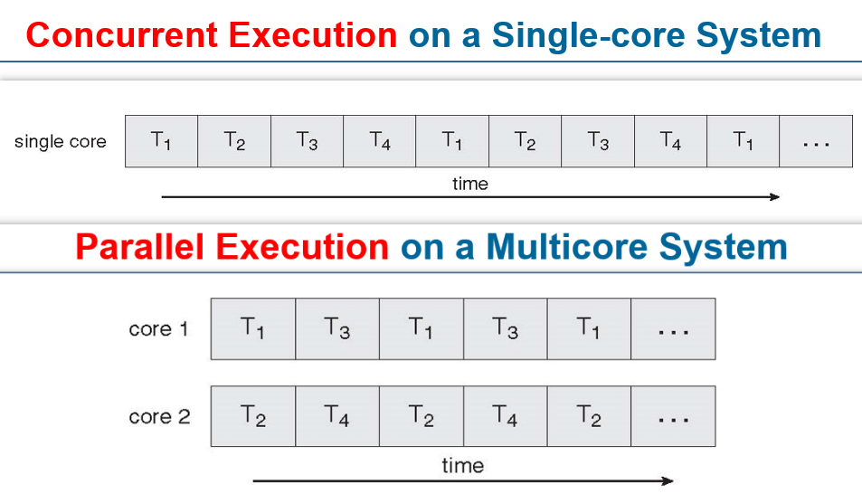
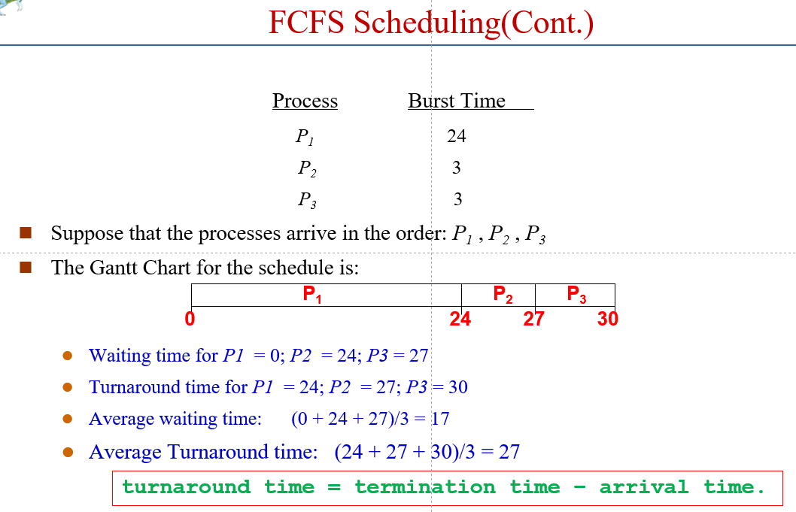

# 操作系统


## 课堂笔记
### ch1 Introduction
课程信息
* 课程实验：在开源的操作系统中实现部分模块
* 十三章，大概十章有作业
* 随堂随机小测

#### 1.1 What Operating Systems Do
Computer four components
1. Hardware
2. Operating system
3. Application programs
4. Users

操作系统是
* **系统软件**
* 用户与硬件的接口
	- 提供命令级接口（键盘鼠标等）和程序级接口（系统调用）
	＊资源管理者
* 扩充裸机的第一层系统软件

有效、合理、方便

#### 1.2 Computer-System Organization
##### 1.2.1 Computer-System Operation
两种结构
1. 总线结构
	- 一些特点
		+ I/O 设备和 CPU 并行运行
		+ device controller 有特定的 device type，local buffuer 和 device driver
		+ I/O 层从 device 到 controller 的 local buffer
		+ CPU 将数据从 local buffer 移动到 main memory
		+ device 完成操作后，通过触发中断告知 CPU
2. 主机型（少有）

Startup
* bootstrap：在开机或 reboot 的时候载入
* 一般存储在 ROM 或 EEPROM 里

Interrupt
* trap（陷入）：由软件产生的中断，因为错误或用户需要产生
* 操作系统是 interrupt driven 的
* 类型（广义中断）
	- 中断（外中断，异步中断）
		+ 可在指令执行的任意时刻中断
	- 异常（内中断，同步中断）
		+ 一条指令终止执行后才会发出中断

##### 1.2.2  Storage Structure
Main memory（主存）和Secondary storage（辅存，如硬盘）

Caching（高速缓存）

##### 1.2.3 I/O Structure
I/O
* 程序 I/O
* 中断 I/O
* DMA 方式
* 通道方式

* 同步 I/O：controls 的返回要等待 I/O 完成
* 异步 I/O：不需要完成

DMA（Direct Memory Access 直接内存访问）
* device 直接访问 main memory（不经过 CPU）
* 用于高速 I/O 设备

#### 1.3 Computer-System Architecture
Single-Processor Systems（单处理器系统）
Multiprocessor Systems（多处理器系统）
* parallel systems（并行系统），tightly-coupled systems（紧耦合系统）
* asymmetric multiprocessing，symmetric multiprocessing（非对称：例如有一个中心）
	- symmetric：每个 CPU 包含 registers 和 cache，memory 共用

Processor > CPU > Core
* Multicore：一个 CPU 有多个计算单元 Core
* Multiprocessor：一个 Processor 有多个 CPU

Clustered System（集群系统）
* 互联的主机（节点）构成统一的计算机资源
* 通过 SAN（storage-area network，存储区域网）共享存储

#### 1.4 Operating-System Operations
Dual-mode operation
* Kernel mode（内核态）
	- Privileged instructions
	- 使用内核栈
* User mode（用户态）
	- 使用用户栈

Timer（定时器）：防止死循环

#### 1.5 Resource Management
Process Management（进程管理）
* program 是 passive entity，process 是 active entity
* 进程需要 resources

Memory Management

File-system Management

Mass-Storage Management

Caching

I/O Subsystem

#### 1.6 Security and Protection
#### 1.7 Virtualization
模拟其他 OS

VMM（Virtual Machine Manager）
* 运行在硬件之上
* Kernel 运行在每个 VM 之上

#### 1.8 Distributed Systems
#### 1.9 Kernel Data Structures
各种链表、二叉搜索树、哈希表

Linux 的数据结构在如下 include 文件中：`<linux/list.h>`、`<linux/kfifo.h>`、`<linux/rbtree.h>`

#### 1.10 Computing Environments
Traditional（传统计算）
1. Mainframe Systems（大型机系统）
	- Batch Systems（批处理系统）
		+ Multiprogramming（多道程序）
			* 内存中同时存放多个 jobs
			* CPU 进行 multiplex（多路复用）
	- Time-Sharing Systems（分时系统）
		+ 也叫 multitasking（多任务）
		+ 多个用户分时共享使用同一台计算机，依次轮流使用时间片
		+ interactive computing
		+ 指标：响应时间

Mobile（移动计算）
Client-Server（客户机-服务器计算）
Peer-to-Peer（点对点计算）
Virtualization（虚拟化计算）
Cloud Computing（云计算）
Real-Time Embedded Systems(实时嵌入式系统)

#### 1.11 Free and Open-Source Operating

### ch2 Operating-System Structures
#### 2.1 Operating-System Services
给用户提供的功能
* User interface：CLI、GUI 等
* Program execution：管理 CPU 资源
* I/O operations
* File-system manipulation
* Communications
* Error detection

System Calls【P17】
* 一般由高级语言所写（C，C++）
* 一般通过 API 库（更高层）进行系统调用
* 参数传递
	- 直接通过寄存器
	- Table（寄存器放地址）

#### 2.2 User Operating System Interface
#### 2.3 System Calls
#### 2.4 System Services
系统服务：方便用户使用（例如文件管理、状态信息等）

#### 2.5 System Programs
#### 2.6 Operating System Design and Implementation
User goals，System goals

Two principles: Policy(What will be done) & Mechanism(How to do it)

#### 2.7 Operating System Structure
1. Simple Structure
	- 例如：MS-DOS，没有模块化
2. Layered Approach（层次结构）
	- layer 0: hardware
	- layer 1: user interface
3. Monolithic Structure（单/宏内核结构）
	- 宏内核：传统方法，内核的全部代码都打包到一个文件中，函数可以互相访问
	- 高效，但是不好修改和维护
	- 例子：UNIX
4. Microkernel
	- 由两部分构成：“微”内核和若干服务
	- 例子：Windows，Mac OS
5. Modules
	- 
6. Hybrid Ststems

#### 2.8 Virtual Machines
#### 2.9 Operating System Generation
#### 2.10 System Boot
### ch3 Processes
#### 3.1 Process Concept
进程状态


1个，0个
9个，0个
10个，0个

Process Control Block（PCB，进程控制块）

#### 3.2 Process Scheduling
##### 3.2.2 Schedulers
* Long-term Scheduler 长程调度
	- 决定哪个进程进入 ready queue
	- 大多现代操作系统没有长程调度
* **Short-term Scheduler** 短程调度
	- 接下来哪个进程被 CPU 执行
* Medium-term Scheduler 中程调度
	- 换出（swapping）：将进程从内存临时移出

两种进程
* I/O 型进程（长程调度为主）
* CPU 型进程（短程调度为主）

##### 3.2.3 Context Switch
CPU 切换进程，Context 即 PCB

#### 3.3 Operations on Processes
#### 3.4 Interprocess Communication
#### 3.5 IPC in Shared-Memory Systems
#### 3.6 IPC in Message-Passing Systems
#### 3.7 Examples of IPC Systems
#### 3.8 Communication in Client–Server Systems
### ch4 Thread & Concurrency
#### 4.1 Overview
process
* Unit of Resource ownership（资源拥有单位）
* Unit of Dispatching（调度单位）

thread
* 进程内的一个执行单元或一个可调度实体
* 不拥有系统资源（只有少量运行时必不可少的资源，如 register、stack）
* 一个进程中的多个线程可并发执行
* 系统开销小，切换快
* 共有：code section，data section、操作系统资源

优点
1. 创建和结束进程花费时间少
2. 两个线程的切换花费时间少
3. 同一进程内的线程共享内存和文件，相互通信无需调用内核
4. 适合多处理机系统

#### 4.2 Multicore Programming


#### 4.3 Multithreading Models
> POSIX：可移植操作系统接口。一套 API 标准（将系统调用抽象），用户可以用相同的函数在不同的操作系统上实现相同的功能。

User Threads（用户级线程）
* 应用维护相关信息
* 线程发起系统调用，阻塞，整个进程在等待

Kernel Threads （内核级线程）
* 内核维护相关信息
* 线程发起系统调用，阻塞，不会影响其他线程

三种模型（用户-to-内核）
1. Many-to-One Model
	- 优点：操作系统不需要支持多线程
	- 缺点：没有真正并行；一个阻塞全要等待
2. One-to-One Model
	- 优点：（简单），可并行，每个线程独立
	- 缺点：线程操作负载重（higher overhead）
3. Many-to-Many Model

Two-level Model：多种模型结合

#### 4.4 Thread Libraries
两种实现
1. 全在 user space
2. 操作系统支持的 kernel-level library

#### 4.5 Implicit Threading
（隐私多线程）

挑战
* 编程上的挑战
* 程序执行顺序的正确性问题（同步、互斥）

隐私线程：将线程的创建与管理交给编译器和运行时库来完成

\#TODO

#### 4.6 Threading Issues
#### 4.7 Operating System Examples
### ch5 CPU Scheduling
#### 5.1 Basic Concepts
名词：CPU调度/处理器调度/进程调度

程序执行时：CPU Burst Time 和 I/O Burst Time 交替（CPU 执行一段时间，然后等待 I/O 一段时间）
由于进程等待 I/O 时 CPU 空闲，浪费时间，所以操作系统需要将 CPU 使用权转交给其他进程，进行 CPU 调度

* CPU bound 程序：长 CPU Burst 多
* I/O bound 程序：短 CPU Burst 多

#### 5.2 Scheduling Criteria
\#TODO

#### 5.3 Scheduling Algorithms
高响应比优先调度算法 Highest Response Ratio Next(HRRN)
* 计算：响应比R = (等待时间 + 要求执行时间) / 要求执行时间

##### 5.3.1 First-Come, First-Served (FCFS) Scheduling
先来先服务调度
* 适合长进程

计算示例
* 
* 建议使用**甘特图**计算
* 顺序会影响 FCFS 的效果（例如让 P2、P3 先处理，平均等待时间会大大减少）

##### 5.3.2 Shortest-Job-First (SJF) Scheduling
短作业优先调度

变型
* 最短剩余时间优先 SRTF(Shortest Remaining Time First)
* 最高相应比优先 HRRN(Highest Response Ratio Next)

##### 5.3.3 Priority Scheduling
优先权调度

两种
* Non-preemptive priority scheduling（非抢占式优先权调度）：不会打断正在运行的程序
* Preemptive priority scheduling（抢占式优先权调度）

##### 5.3.4 Round Robin (RR)
时间片轮转调度

##### 5.3.5 Multilevel Queue Scheduling
多级队列调度

##### 5.3.6 Multilevel Feedback Queue Scheduling
多级反馈队列调度

#### 5.4 Multiple-Processor Scheduling
#### 5.5 Real-Time Scheduling
#### 5.6 Thread Scheduling
#### 5.7 Operating Systems Examples
Linux scheduling
1. Time sharing
	- （动态）Priority + RR
2. Real-time
	- 实时，参见第一章作业
	- 控制类的场景（如嵌入式）

#### 5.8 Java Thread Scheduling
#### 5.9 Algorithm Evaluation
### ch6 Process Synchonization
#### 6.1 Background
Bounded Buffer 有界缓冲区
* 例如“内存->寄存器->内存”的操作必须保证原子性

Race Condition 竞争条件
* 进程之间竞争资源面临的三个问题
	1. 互斥
	2. 死锁
	3. 饥饿

\#考研 接下来的内容常考

#### 6.2 The Critical-Section Problem
临界区问题
* 临界区：进程使用临界资源（一次只能允许一个进程访问的资源，如打印机、变量等）的代码段
* 需要满足三个点
	1. Mutual Exclusion 互斥
	2. Progress 空闲让进：如果空闲，就要赶紧让进程用
	3. Bounded Waiting 让权等待（不必须）

Peterson's Solution
* 软件方法，两个进程
* ```c
// P1:
do {
	flag[0]= true;
	turn = 1;
	while (flag[1] and turn == 1) ;
	critical section
	flag[0] = false;
	remainder section
} while (1);
// P2:
do {
	flag[1]= true;
	turn = 0;
	while (flag[0] and turn == 0) ;
	critical section
	flag[1] = false;
	remainder section
} while (1);
```

Bakery Algorithm 面包房算法
* 分配排队登记号，按顺序执行
* 排队登记号相同，则进程号小的先执行

#### 6.3 Synchronization Hardware
#### 6.4 Semaphores
信号量
* Semaphore 变量（整型变量）
* 两个函数：wait() 和 signal()

#### 6.5 Classical Problems of Synchronization
#### 6.6 Critical Regions
#### 6.7 Monitors
#### 6.8 OS Synchronization
#### 6.9 Atomic Transactions
## 实验笔记
### lab0
从 Ubuntu20.04 LTS 的终端 下载 Linux 源码
* `apt install linux-source`。如果出现 error，根据提示先执行`apt-get update`
* 下载好的 Linux 源码在`/usr/src`目录下
* `tar -xjvf linux-source-4.4.0.tar.bz2 -C 目标文件夹`（pwd 为 /usr/src）将源码解压到目标文件夹下（会在目标文件夹下再建一个文件夹）

### lab1
#### lab1.md 笔记
使用的是特权模式（privilege mode），不需要看 unprivilege spec

OpenSBI
* 流程
	1. 启动（作为 Bootloader）
	2. 为 S-mode 的内核代码提供接口，用于字符打印等
	3. 注：使用 OpenSBI 进行 Boot，初始化完成后会跳转到`0x80200000`（Kernel 的起始地址），这就是我们编**译后的代码要放到的内存位置**
* 要做的：在 qemu 中使用`-bios default`参数启动

链接需要用专门的方式：`ld`命令。该命令使用链接脚本进行控制（例如 vmlinux.lds）

#### Makefile 笔记
`/Makefile`
```Makefile
export # 将变量传递给子进程（子 Makefile）
CROSS_=riscv64-unknown-elf-
GCC=${CROSS_}gcc
LD=${CROSS_}ld
OBJCOPY=${CROSS_}objcopy

ISA=rv64imafd
ABI=lp64

INCLUDE = -I $(shell pwd)/include -I $(shell pwd)/arch/riscv/include
CF = -march=$(ISA) -mabi=$(ABI) -mcmodel=medany -fno-builtin -ffunction-sections -fdata-sections -nostartfiles -nostdlib -nostdinc -static -lgcc -Wl,--nmagic -Wl,--gc-sections -g 
CFLAG = ${CF} ${INCLUDE}

.PHONY:all run debug clean
all:
	${MAKE} -C lib all # ${MAKE} 表示 make 指令，-C 参数后接路径，表示 make 别处的 Makefile 文件
	${MAKE} -C init all
	${MAKE} -C arch/riscv all
	@echo -e '\n'Build Finished OK # @echo 表示在命令行显示这条指令，-e 表示开启转义

run: all
	@echo Launch the qemu ......
	@qemu-system-riscv64 -nographic -machine virt -kernel vmlinux -bios default 

debug: all
	@echo Launch the qemu for debug ......
	@qemu-system-riscv64 -nographic -machine virt -kernel vmlinux -bios default -S -s

clean:
	${MAKE} -C lib clean
	${MAKE} -C init clean
	${MAKE} -C arch/riscv clean
	$(shell test -f vmlinux && rm vmlinux) # shell test -f 检测后面的文件是否存在
	$(shell test -f System.map && rm System.map)
	@echo -e '\n'Clean Finished
```

`/init/Makefile`
```Makefile
C_SRC       = $(sort $(wildcard *.c)) # wildcard：使用通配符（否则在变量定义时，通配符失效）。这里会将当前目录所有 .c 文件展开到 $(wildcard *.c) 处
                                      # sort 将之后列表中的单词字典序升序排序
OBJ		    = $(patsubst %.c,%.o,$(C_SRC)) # patsubst 将 %.c 格式的单词替换成 %.o 格式

file = main.o
all:$(OBJ)
	
%.o:%.c
	${GCC} ${CFLAG} -c $< # $< 表示第一个依赖文件
clean:
	$(shell rm *.o 2>/dev/null)
```

注意
* vmlinux 和 System.map 文件应该在根目录下

### lab2
实验报告提交截止日期： 11.8 前

## 杂项
