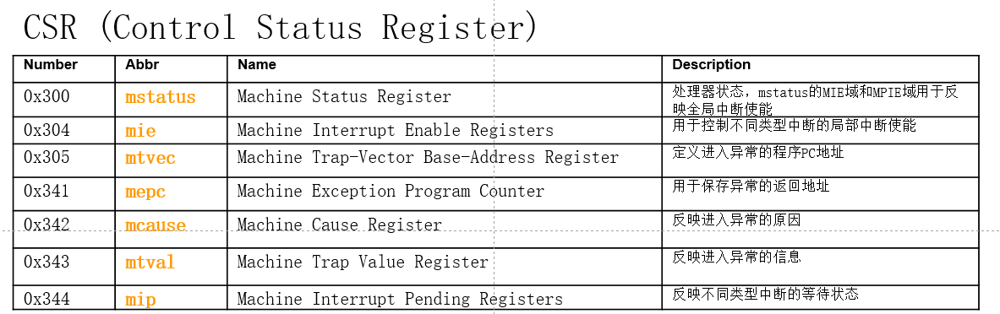

# 计算机体系结构

## 课程信息
[课程网站](https://list.zju.edu.cn/kaibu/comparch2022/index.html)

lab1 实验demo 10.12，报告迟一点

lab1、lab2（+中断） 是流水线

lab3、lab4 cash

lab5 是xx交互策略

## 课堂笔记
### lec01-intro
### lec02-fundamentals-basics
**I**nstruction **S**et **A**rchitecture (ISA)

### lec03-fundamentals-performance
Performance Trends
* Bandwidth/Throughput
* Latency/Response Time

### lec04-memory-basics
整章：Memory Hierarchy Design Basics

优化方式是有利有弊的

Main Memory
* 两种 performance measures
	1. Latency：延迟，从 block 获取第一个 word 的时间
		+ access time：从 access 请求到获取的时间
		+ cycle time：两个 access 请求之间的时间
	2. Bandwidth：带宽，获取整个（其余）block 的时间
* SRAM for cache, DRAM for main memory
	- SRAM（Static Random Access Memory）

Cache
* Direct Mapped Cache
	- | Valid(1) | Tag(20) | Data(32) |
	- 先把内存分组（block），然后再算
	- 用 cache 的大小除以 block 大小，得到 cache 的行数（lines）
	- 对于内存中的地址，首先去掉 block 的大小，然后根据行数对应的大小放到 cache 里（tag 和 data）

### lec05-memory-advances
### lec06-ilp-static
Instruction Level Parallelism

### lec07-ilp-dynamic
...

* [ ] 知识点：Functional Unit Status

## lab0 (warmup)
### lab0.1 Vivado
[Verilog Practice in HDBLBits](https://hdlbits.01xz.net/wiki/Main%20Page)

[Verilog: wire vs. reg](https://inst.eecs.berkeley.edu/~cs150/Documents/Nets.pdf)

阻塞赋值：最好只在`always @(*)`中使用，左侧必须为 reg

`always @(*)`
* 本质上是组合逻辑
* 可以用一些方便的写法（如 if-else），但有一些潜在问题

if-else 语句、case 语句
* 不能传播不定态
* 生成优先级电路，不能生成并行电路

Verilog **仿真**：Stratified Event Queue（分层事件队列）
* `always @(*)`：多个的执行顺序任意，在一个 always 里顺序执行

* [X] [Verilog的分层事件队列](https://www.cnblogs.com/loves6036/p/5630214.html)

板子型号：xc7k325tffg676-2L

## lab1
### lab1.1 工程需要补全的部分
auxillary/：
common/cmp_32.v：一处
core/CtrlUnit.v：一大堆
core/HazardDetectionUnit.v：全部
core/RV32core.v：好几处

### lab1.2 工程笔记
RAM 和 ROM 文件
* 综合（Synthesis）的时候放在相对路径（相对`RAM.v`和`ROM.v`）
* 仿真（Simuation）的时候放在`Exp1.sim/sim_1/behav/xsim`里

## lab2
### lab2.1 基础知识
异常和中断的区别
* Exception 回到当前指令，Interrupt 回到下一条指令

CSR（Control Status Register）
* CSR 的地址空间有 12 位（十六进制 3 个字符）
* 注：通用寄存器是 GPR
* 一些 CSR （机器模式，以 m 开头）
	
	补充：0x306 | mcounteren | Machine counter enable

寄存器操作
* mstatus `0x300`：【要修改】进入和退出中断异常时，需要修改相应 field （当前中断使能，存储和恢复上次的使能与特权模式）
* mtvec `0x305`：进入中断异常时，由该寄存器决定 PC 跳转的位置（本实验都跳转到同一个中断响应程序）
	- 在实验中，mtvec 的值在汇编代码里手动指定了
* mcause `0x342`：【要修改】异常发生的原因（Illegal Instruction，ECALL，L/S 地址超范围）
* mepc `0x341`：【要修改】返回地址，异常返回原 PC，中断则是原 PC + 4

### lab2.2 Pipeline 中的处理方法
四种中断异常
1. IF: Memory Fault (Illegal Memory Address)
2. ID: Illegal Instruction
3. EX: Arithmetic Exception
4. MEM: Memory Fault (Illegal Memory Address)

流水线中：异常信息在流水线中传下去，到 WB 阶段才处理

### lab2.3 代码
Exception Unit：管理 CSR 寄存器

关于三类中断异常是如何产生的
* CtrlUnit 里有 ecall 指令和 Illegal Instruction 的判断
* 读写指令地址错误在 WB 阶段的 l_access_fault_MEM, s_access_fault_MEM 信号中体现

exp_vector_WB
* illegal_inst：[3]
* ecall_m：[2]
* l_access_fault：[1]
* s_access_fault：[0]

状态机

### lab2.4 仿真
0x00000038：ecall

## ass1
[tips for pre](http://www.bailis.org/blog/you-can-do-research-too/)
[example pre](https://video.seas.harvard.edu/media/Justine+Sherry+3+21+2016+%5BCS%5D/1_j8n61f34/13151381)

### ass1.1 论文笔记
#### ass1.1.0 Abstract
《Enabling Branch-Mispredict Level Parallelism》

问题：对于错误预测的 Branch，重用被错误加载的指令（而不是浪费掉）

采用 hardware-software cooperative 的方法，通过 Parallelism 解决

#### ass1.1.1 Introduction
**P1** Processor development
* 以前对 efficiency 不够关注 -> prediction & speculation，有大量 instructions 被白白 fetch 和 execute
* > out-of-order execution：乱序执行，允许 CPU 不按程序原本的顺序执行指令
	> instruction window：在 out-of-order 的基础上，一段被 reorder 的指令被称为 instruction window

**P2** Branch prediction
* 当 instruction window 变大时，mispredict 的代价变高
CPU Application 变得 irregular，因为 regular 执行在越来越多的 high peak compute rate 体系上

**P3** In this paper
* 在 conventional out-of-order processer 上，让一些 non-flushed instruction 可以不被 refetched 和 re-executed

**P4** Not flushing
* 软件负责指定 independent code fragments（是否可以 non-flushed），硬件只 flush 必须依赖 branch miss 的

**P5** The novel instructions

**P6** (i) A hardware only
* 结合软件的优势：不需要通过硬件实现复杂的 detection、prediction 和 rollback
* 编写软件的时候本来就需要考虑硬件（例如并行程序）

**P7** Regarding the

**P8** In this paper
* 三点贡献
	1. hardware-software cooperative，有着 minimal changes
	2. 提供不同 performance/complexity 比例的 implementation
	3. 用图像展示了效率的提高

**P9** We first discuss
1. prior work，传统 out-of-order processer 的 refresh memory on branch recovery 机制
2. 软硬件结合的具体方法
3. 实验和结果分析
4. 总结

#### ass1.1.2 PRIOR WORK ON BRANCH MISS OPTIMIZATIONS
**P1** Branch convergence and selective flushing
* 古老的优化技术（20 年前）：Branch convergence and selective flushing
* Branch Convergence: executing instructions of the two branches simultaneously in their respective subsets of lanes
* Selective Flushing

**P2** Since then, a lot of proposals
* 研究 branch convergence 的两种思路
	1. 重新设计 processor pipeline
	2. 少量重用 instructions，小修改

**P3** Skipper [11] belongs to the first category
* 第一种思路

**P4** An example of the second category
* 第二种思路

**P5** Our proposal lies somewhere in the middle
* 介于中间
* 避免 architecture 上的大变化
* 避免高开销的预测、依赖检查、回滚等等机制（compiler hints）
* 乱序执行：对 branch independent 的指令可以 out of order

**P6** As an alternative to reusing converging instructions
* 在重用 converging instructions 的时候，可以采用多线程技术

**P7** Another way of reducing the performance degradation
* 对 hard-to-predict 的 branc：predication

**P8** Farzad et al. found that wrong-path control and data independent code
* wrong-path control and data independent code 耗电量大
* branch-miss level parallelism (BLP)

**P9** Branch resolution is often delayed by long-latency cache misses

## ass2
### ass2.1
ch1
概念题
a. Two kinds of parallelism in applications
b. For major ways to exploit (1.)
c. Principle of dynamic voltage-frequency scaling (DVFS)
d. Principle of overlocking

### ass2.2
ch1
需要的知识
* processor performance equation.
* FP, CPI, FPSQR

### ass2.3
ch2 & appendix B

LRU 在大循环中是怎么失效的
* (a) asymptotic instruction miss rate (loop size = 64 bytes)
* (b) loop size = 192 bytes or = 320 bytes
* (c) for MRU, which loop size benifits

### ass2.4
ch2 & appendix B

memory access using cache
* (a) average memory access time
* (b) (giving memory and cache's space) average memory access time
* (c) using cache, G & L (not miss: faster; miss: slower) -> highest miss rate

### ass2.5
ch2 & appendix B

16-way set associative cache -> bits of tag, index, offset

### ass2.6
## 资料
### Operating Systems: Three Easy Pieces
[Operating Systems: Three Easy Pieces](https://pages.cs.wisc.edu/~remzi/OSTEP/)

免费在线电子书，讲**操作系统**，从 **virtualization**、**concurrency**、**persistence** 三个方面讲
