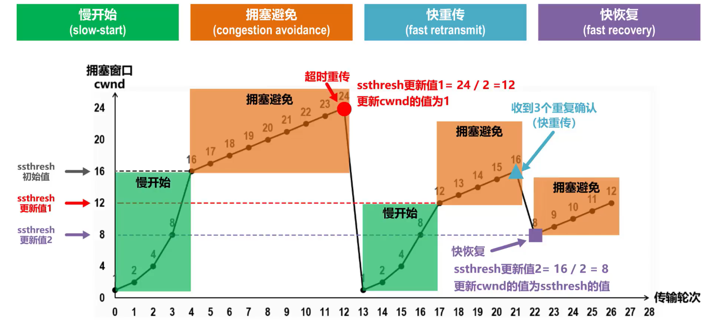

# 计算机网络

## 课程信息
实验可能要第八周才去做

实验个人做。可以一起做，但报告每个人自己写

建议预习

## 课堂笔记
### ch1 Introduction
#### 1.1 网络的概念
概念
* （必须）由自制（？）的计算机构成

计算机网络的首要功能：资源共享

#### 1.2 网络的应用
网络模型
* 客户服务器模型（**client-server** model）
	- request & reply
	- 用户使用越来越方便（抽象）：（直接操作扇区）-> 文件服务器 -> 数据库服务器 -> 应用服务器
	- 数据传输量不对称（下载的更多）
* 对等通信模型（peer-to-peer 模型，**p2p** 模型）

电子商务
* B2C（Business-to-consumer）
* B2B（Business-to-business）
* G2C（Government-to-consumer）
* C2C（Consumer-to-consumer）

Wireless 和 Mobile（例如手机是无线+移动，固话是有线+固定）
* 注意：**移动要看 IP 地址变不变**
* 这个分类没有很严格

#### 1.3 网络的类型
远程网（广域网，WAN，Wide Area Network）-> 局域网（LAN，Local Area Network） -> 城域网（MAN）
* WiFi：无线局域网（WLAN，Wireless Local Area Network）
	- WiFi 是一种 WLAN
	个人区域网（PAN）

注：名称的变化为，先有远程网，再有局域网，然后远程网改名广域网

Broadcast Networks
* 传输技术类型
	- Broadcast links
	- Point-to-point links
* scale：1 m -> 10,000 km

拓扑结构
* 局域网（LAN）
	bus & ring
	
	
* 广域网（网状网，WAN）
	**subnet**：子网
	**router**：路由器
	**packet**：数据包
	
	

（以上为技术分类）以下为业务分类，Content Provider Networks
* Date-center network（and Date center network challenges）
* CDN（内容分发网络，Content Delivery Network）

#### 1.4 网络的结构

protocol：协议
* 通讯之间发送的包（数据单元）的**格式、时序**等

分层，层与层之间有接口

发送端从高层到底层修改数据，修改后的数据由物理层发送，接收端接受后将数据由低层复原到高层

Design Issues for the Layers

##### 1.4.1 OSI 模型

主机 Host A（7）-> 路由器 Router（3）-> 路由器 Router（3）-> 主机 Host B（7）

七层（名称 - 数据）
1. Physical（物理层）- Bit
	- 通讯媒介，比如电线
	- 物理上直接相邻的两个节点通过物理层的工作向更高层提供一个面向二进制流（比特流，位流）的传输服务
	- 涉及到的东西
		+ 机械的（水晶头尺寸等）
		+ 电气的（用什么表示01）
		+ 功能的
		+ 过程（时序）的
2. Data link（数据电路层）- Frame
	（物理上相邻）
	- 三个任务
		1. frame 的定界、同步等、成帧（framing）
			* frame：一个数据块
		2. 差错控制
		3. 流量控制
3. Network（网络层）- Packet
	- 把数据电路串起来，让非互邻的节点也能相连
	- 三个任务
		1. 路由选择
		2. 中继/转发
		3. 网络互联（越连越大）
4. Transport（运输层）- TPDU
	- 【？】N to N（端对端）
	- 解决……剩下的问题
		+ 例子：为了保证安全性，将多个运营商的服务复用在一起
	- 通讯问题的最后一层
	- PDU（Protocol Data Unit，协议数据单元）
5. Session（会话层）
	- 通讯管理：单工（单向传输）、双工（双向传输）、半双工（同时只能单向，但可以切换方向）、全双工
	- 同步点（如下载）
6. Presentation（表示层）
	- ~~抽象语法和传送语法~~
	- 大小端（Big Endian、Little Endian）的问题等
7. Application
	- 

##### 1.4.? Connection-Oriented and Connectionless
面向连接和无连接协议

udp -> tcp
* 比喻：udp 是寄信，tcp 是电话

#### 1.5 参考模型
#### 1.6 网络实例
##### 1.6.1 The Internet
###### The ARPANET
世界上的第一个计算机网络（目前已停用）

预留不分配的地址（如 192.168.1.1）其一来自于此

###### 1.6.2 Internet
互联网是**分层次**、**无中心**的

###### 1.6.3 Mobile Networks、
AN（接入网），CN（核心网）
* 4G、5G 的概念在 AN

#### 1.7 网络标准化

### ch2 The Physical Layer
要讨论的大问题
1. 数据通讯的理论基础
2. 各种技术（电路，复用，网络）

#### 2.1 Theoretical Basis for Data Communication
信号可以有傅里叶分析
线路的最高频率是有限的（最大带宽）

Nyquist’s theorem
* 采样：连续信号 -> 离散信号
* 信噪比
* 最高频率 H，则最大样本数为 2H
	$\text{maximum data rate} = 2B\log_2\text{bits / sec}$

Shannon's formula for capacity of a noisy channel
* 信噪比 S/N
* $\text{maximum number of bits / sec} = B\log_2(1+S/N)$

#### 2.2 Guided Transmission Media
（直接的物理媒介）

* Magnetic media
	- 拿卡车运磁盘
* Twisted pairs（双绞线）
* Coaxial cable（铜轴电缆）
* Power lines（输电线）
* Fiber optics（光纤）

#### 2.3 Wireless Transmission

* 波段需要管制
* 有共用的波段（2.4G，5G）

#### 2.4 Communication Satellites
##### 2.4.1 Geostationary Satellites
VSATs，使用 Hub：地面，将信号中转并放大

#### 2.5 Digital Modulation and Multiplexing
##### 2.5.1 Baseband Transmission
* 时钟问题（如果不同步，采样就会有误）
* 异步通讯（需要额外 bit，耗带宽，高速通讯代价高），同步通讯

##### 2.5.2 Passband Transmission
1. binary signal
2. amplitude shift keying（调幅）
3. frequency shift keying
4. phase shift keying

##### 2.5.3 Frequency Division Multiplexing
##### 2.5.4 Time Division Multiplexing
##### 2.5.5 Code Division Multiplexing
Code Division Multiplexing（CDMA，Code Division Multiple Access）

#### 2.6 The Public Switched Telephone Network
Structure of the telephone system
	
1. 全连接（Fully interconnected netword）：规模太大
2. Centralized switch
3. Two-level Hierarchy：

Politics of telephones
Local loop: modems, ADSL, and fiber
Trunks and multiplexing
Switching

#### 2.7 Mobile Telephone System
1. First Generation（1G）：模拟技术，只支持话音通讯，（普通）频分复用
2. Second Generation（2G）：数字技术（之后都是），只支持话音通讯，2 个标准
	- 接入网、核心网
3. Third Generation（3G）：数字技术，支持话音通讯和数据通讯，CDMA 复用，3 个标准
4. Forth Generation（4G）：
	- 也叫 IMT-Advanced

#### 2.8 Cable Television
### ch3
帧的定界，差错控制，流量控制

###### Error Detection
差错控制
* 两件要干的事：检错，纠错
* 两种差错：单帧的，帧与帧之间的

###### Flow {?}
肯定应答，否定应答，定时器，ID（sequence number）

Ack（接收方需要确认）

如果包丢失，不能简单通过肯定/否定应答检验，需要定时器

确认
* 对帧的确认是累计的
* 捎带确认（把确认信息捎带在包里发送），piggyback acknowledgement

Go Back N
* 如果有 n bit，发送方的最大窗口大小为 $2^n - 1$

## 实验
周三下午和周五晚上都可以去

### 实验一
## 作业
### Chapter 1 exercise
#### Q1
OSI layers

#### Q2
加入 header 数据后，带宽占比

答案：12%。计算方法为$\frac{20\ bytes\times (7-1)\ layers}{1000\ bytes}$

#### Q3
802.3 standard 下的 bit 长度

拿传输速度 m/s 除以信号传输 Mbps

#### Q4
client-server system，使用卫星，请求相应延迟？

request 和 response 都要通过卫星中转一次，所以是$\frac{(40000\ km\times 2)\times 2}{300000\ km/s} = 533.33\ s$

#### Q5
connectionless communication 和 connection-oriented communication 的区别

### Chapter 2 exercise
#### Q1
H 信道宽，V 级数字信号，则根据奈奎斯特定律，$带宽 = 2Hlog_2 V$

#### Q2
$x\ dB = 10^{x/10}$

根据香农定律，$最大速率 = B log_2 (1+S/N)$ = 25.3188498377676382190510882056

注意还要看奈奎斯特定律的限制

#### Q3
FDM (Frequency Division Multiplexing) 中的 guard band
* 在频带与频带之间，所以 n 个频带需要 n-1 个保护频带

#### Q4
Because PCM(Pulse Code Modulation) is 4kHz wide, and according to Nyquist theorem, the maximum data rate is 2Blog2(2 bits/sec) = 8k, so it makes 8000 samples per second, which is 125 μsec.

#### Q5
（以 E1 为例）
E1 总共有 256 bit，其中有 30 个 8 bit 的信号给用户使用，所以 percent overhead 为 $(256-30*8)/256$

### Chapter 3 exercise
### Chapter 6 exercise
运输层基础知识
* 运输层涉及到主机中的进程，端口号就是为了区分进程
* 运输层有两种协议：面向连接的 TCP，无连接的 UDP

拥塞控制（congesion control）
* 缩写
	- swnd：发送窗口
	- cwnd：拥塞窗口
	- ssthresh：慢开始门限	
	- TPDU：传输协议数据单元
	- MTU：最大传输单元，指网络能够传输的最大数据包大小（字节数）
* 慢启动
* 快重传
	1. 要求接收方不要等到自己发送数据时才捎带确认，而是要立即发送确认
	2. 即使收到了失序的报文段也要立即对已收到报文段的重复确认
	3. 发送方一旦收到3个连续的重复确认后，就将相应的报文段立即重传，而不是等该报文段的超时重传计时器超时再重传
* 快恢复

### Quiz3
### Quiz4
#### Part1
[生成树算法STA](https://blog.csdn.net/LY_624/article/details/111041139)
