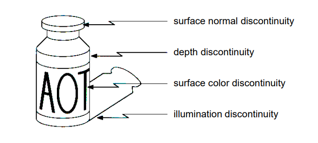
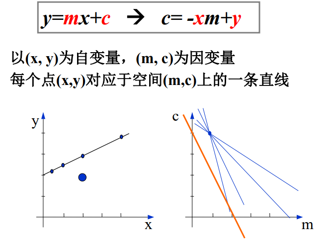
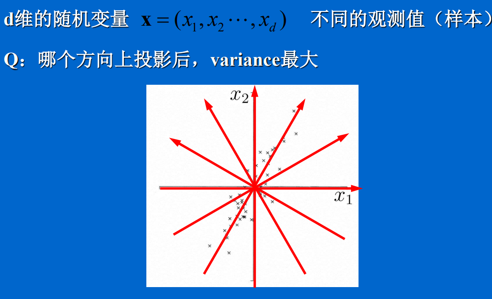

# 计算机视觉

## 课程信息
资料在钉钉，作业在学在浙大

作业 50%，考试 50%

推荐书籍
* [Computer Vision: Algorithms and Applications](http://szeliski.org/Book)
	- 和计算机图形学的交叉很好

编程：OpenCV
* 五个作业，每个 7-10 天
* 最迟可以到期末考评分完之前交，但是迟于各自 deadline 的会按 80% 算
* 内容：源程序，可执行二进制文件，实验报告

考试
* 闭卷考试

## 课程内容
### Preface & OpenCV Tutorial
计算机中图像的本质
* 矩阵
* 像素点
	- 用一个 byte 存储一个像素点：灰度图（Gray Scale）
		+ 常用，很多算法的缺省就是灰度图
	- 色彩空间：RGB，HSV
		+ 为了读取方便，有时候会一次读取 4 个 byte（前三个是 RGB，最后一个没有用）
* 用函数表示图像
	- $f: R^2\rightarrow R$，f 将坐标映射为 instensity（$f(x, y)\rightarrow (x, y)$）

OpenCV

### Chapter1 Introduction
### Chapter2 Edge
#### 2.1 边缘及边缘检测概念

问题定义：Identify **sudden changes (discontinuities)** in an image

**四个类别的 change**
	
1. surface normal discontinuity：曲面的法向跳跃了
2. depth discontinuity：深度
3. surface color discontinuity：颜色变化
4. illumination discontinuity：阴影

检测方法
1. 求灰度值的导数
2. 对导数再求导，找一阶导极值点（二阶导零点）

噪声问题
* 高斯滤波

#### 2.2 用模板实现卷积
对于模板矩阵不能覆盖边缘像素点的问题
1. （类似无限循环空间）将另一边的像素点复制过来考虑
2. 将旁边的像素点对称过来考虑（再算一次）

模板矩阵：$T(x,y) (n\times m)$
图像：$I(x,y) (M\times N)$
T 和 I 的卷积：
$$
T\times I(X,Y) = \sum_{i=0}^{n-1}\sum_{j=0}^{m-1}T(i,j)I(X+i,Y+j)
$$

#### 2.3 基于一阶导数的边缘检测

#### 2.4 基于二阶导数的边缘检测
##### 2.4.1 Laplacian 算子
##### 2.4.2 LoG 算子 （Marr & Hildreth 算子）
#### 2.5 Canny边缘检测
### Chapter3 Curve
#### 3.1 曲线表示
#### 3.2 曲线拟合
#### 3.3 Hough 变换
原理：投票原理

**直线检测**
	
* $y = mc + c \quad\rightarrow\quad c = -xm + y$
* (x,y) 空间下的每个点，为经过这个点的所有直线投票，在 (m,c) 空间中反映为一条直线
* 实际采用极坐标表示（避免垂直直线的问题），需要离散化
* 步骤
	1. **量化**（离散化）参数空间
	2. 累加器**初始化**为零
	3. 对图像空间的每个点，在其所满足的参数方程对应的累加器上**加 1**
	4. 累加器阵列的**最大值**对应模型的参数

### Chapter4 *
图像的特征识别

虹膜识别

Invariant Local Features
* 在什么位置提取特征比较好（Feature detection）
* 怎么提取（Feature descriptors）

Feature Detection
* 选取一个局部区域，移动区域，看图像变化大不大
	- flat：各种方向都没变化
	- edge：有一个方向没变化
	- corner：各种方向都有变化

$$
E(u,v) = \sum_{x,y}w(x,y)[I(x+u,y+v)-I(x,y)]^2
$$

### Chapter 6
类似，傅里叶变换，把图像理解为简单图像的线性组合
* 最简单的方法：原图像的每个像素作为一个基图像，即该像素点为白，其他地方为黑

人脸识别的原理：找到人脸的基图像

主元分析法
* 回顾：随机变量的数字特征
* 用途：减少维度（reducing dimensionality），但最大程度保留原来的特征
    
* 问题 1：求投影方向，使方差最大
	- $\mathop{\arg\max}\limits_{a_1}\ var(z_1)$
		+ $$
		\begin{align}
		var(z_1) &= E(z_1^2)-[E(z_1)]^2 \\
		         &= ... \\
		         &= \sum_{i,j=1}^d a_1^i a_1^j S_{ij},\ S_{ij} = E(x_i x_j) - E(x_i)E(x_j) \\
		         &= a_1^T S a_1 \\
		\end{align}
		$$
		S 是协方差矩阵
* 求解：Lagrange 乘子法
	- 设 $\lambda$ 为 Lagrange 乘子，则转为最大化
		$$
		a_1^T S a_a - \lambda(a_1^T a_1 - 1)
		$$
		求微分，得必要条件：
		$$
		\begin{align}
		             & S a_1 - \lambda a_1 &=&\ 0 \\
		\Rightarrow\ & S a_1 &=&\ \lambda a_1
		\end{align}
		$$
* 问题 2：在哪个与上述求出的方向正交的方向上投影，方差最大
	- ...
	- 求特征向量

人脸识别
* 训练：求特征向量

## 作业
### HW1
需要的知识点
* 【核心内容】生成视频
* 将视频保存到文件（指定文件名）
* 镜头切换
* 读入图像，显示图像
* 显示文本
* 绘制图形

### HW2
Harris Corner

需要自己写 Harris Corner 检测算法

### HW3
拍十张照片

如果矩阵太大：SVD（奇异值……）
